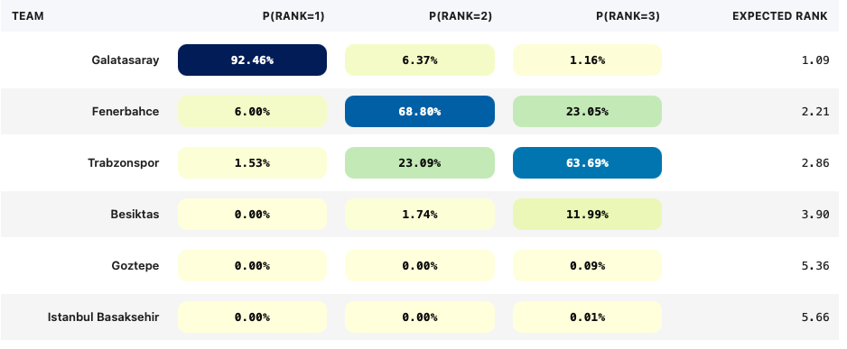

# idda

Monte Carlo / Poisson-style tooling for simulating league outcomes (for exploration and learning).

## Disclaimer
This project is **for demonstration and fun purposes only**. The outputs are **not** intended as betting tips, wagering guidance, or financial advice.

Predictions from this repo may be inaccurate, incomplete, or non-actionable. Any decision to bet (or to trade/otherwise use the outputs) is solely your responsibility. By using this code/data, you agree that the author is not liable for any losses.

## Rank visualization example
An example of the notebook output (probability of finishing 1st/2nd/3rd plus expected rank) is in [`docs/ranks.png`](docs/ranks.png):

## What `simulate_league.ipynb` does
This notebook simulates the remaining fixtures in `data/super_league/scores_with_venue.csv` using a week-by-week (autoregressive) Monte Carlo approach:
1. It finds the first week containing missing scorelines (cells with `?`) and treats earlier weeks as already played.
2. For each Monte Carlo run it maintains pooled goals-for and goals-against per team from all known games so far in that run.
3. For each upcoming fixture it converts the pooled summaries into Poisson goal rates (`lambda`), applies a fixed home advantage multiplier for the host, and samples a scoreline when the fixture is missing.
4. After simulating through the last week it computes final league points and ranks teams using head-to-head tie-breaks, then aggregates results across runs to estimate `P(rank=k)` and expected rank.

